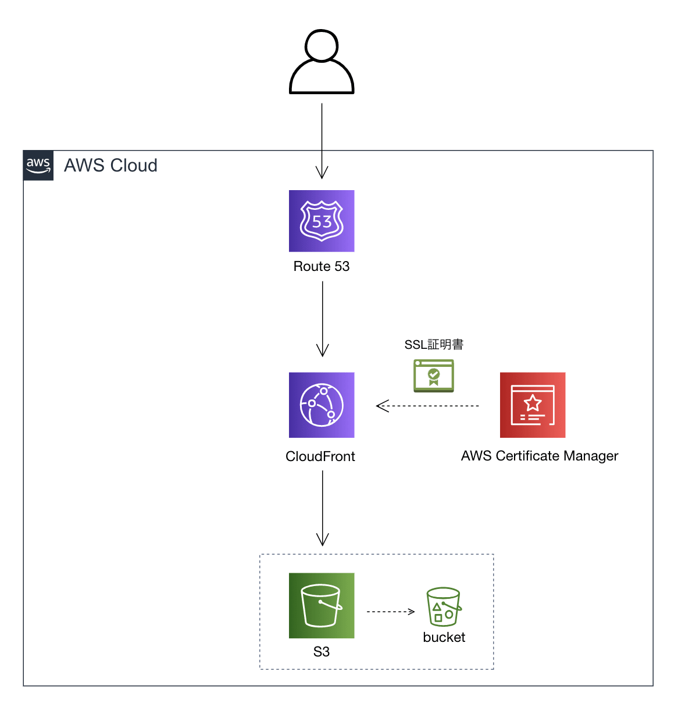

# kayo-portfolio
 牟田佳代のポートフォリオサイトです。
 JavaScript、jQueryを使用しており、レスポンシブ対応しているのでスマホからもご確認いただけます。全てデザインカンプからのコーディングをしており、デザインカンプはAdobeXDとFigmaを使用しました。
 AWSのRoute 53にてドメインを取得、SSL証明書を発行後、CloudFrontを利用してサーバーアップを行いました。
  

 

 # URL
 https://kayo-muta.com/

 # 使用技術
- JavaScript
- jQuery
- AWS
  - Route53

 # 実装内容
 Productsには 
 1.自身のポートフォリオサイト 
 2.8ページの架空WEBサービス会社サイト 
 3.架空ジムサイト 
 の3つをのせています。

 それぞれのサイトで違う動きを取り入れることを意識して制作しました。

## 1.自身のポートフォリオサイト
- ローディング画面
- ハンバーガーメニュー
- フェードイン
- TOPに戻るボタン
- スクロールするとヘッダーを固定

#### こだわった点
1.ローディング画面
間差で正方形が回るように動きをつけ、ローディングに時間がかかった場合、
離脱率を上げないよう一定の時間で強制終了させるようにしました。

2.awsを利用することで、SSL証明書を取得しHTTPS化、セキュリティーの強化を行いCloudFrontを使い静的ウェブコンテンツの配信を高速化しました。

デザインカンプはAdobeXDを使用。

## 2.8ページの架空WEBサービス会社サイト
- ハンバーガーメニュー
- TOPに戻るボタン
- スクロールするとヘッダーを固定
- スクロールダウン
- Googleマップの挿入
- YouTubeの挿入
- スライドショー
  - swiper

#### こだわった点
1.スライドショーでswiperの実装
  position: absoluteでスライドショーと背景の前後関係を作りスライドショーに目がいくような
  レイアウトにし、画面サイズが変わっても崩れが起きないように気を付けました。
  一定時間で画像がスライドしたり矢印を押すことで好きなタイミングで切り替わるようにしました。

2.スクロールダウン

　デザインカンプはAdobeXDを使用。

## 3.架空ジムサイト
- テキストがスライドで表示
- フェードイン
- TOPに戻るボタン
- スクロールするとヘッダーを固定
- タブ切り替え
- アコーディオンメニュー
- スライドショー
  - slick

#### こだわった点
1.slickの実装
　2つ目の8ページの架空WEBサービス会社サイトと違うプラグインを使用したいと思いslickを
　実装しました。こちらはループ再生にしスタジオの雰囲気などが感じられるようにしました。

2.テキストがスライドで表示

3.タブ切り替え

4.アコーディオンメニュー

  デザインカンプはFigmaを使用。

※共有のためにまとめてデプロイしています。